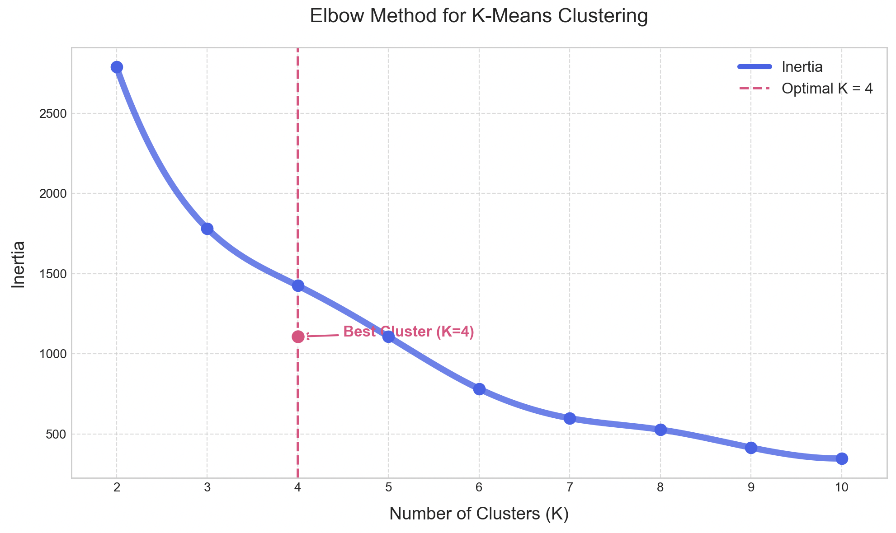
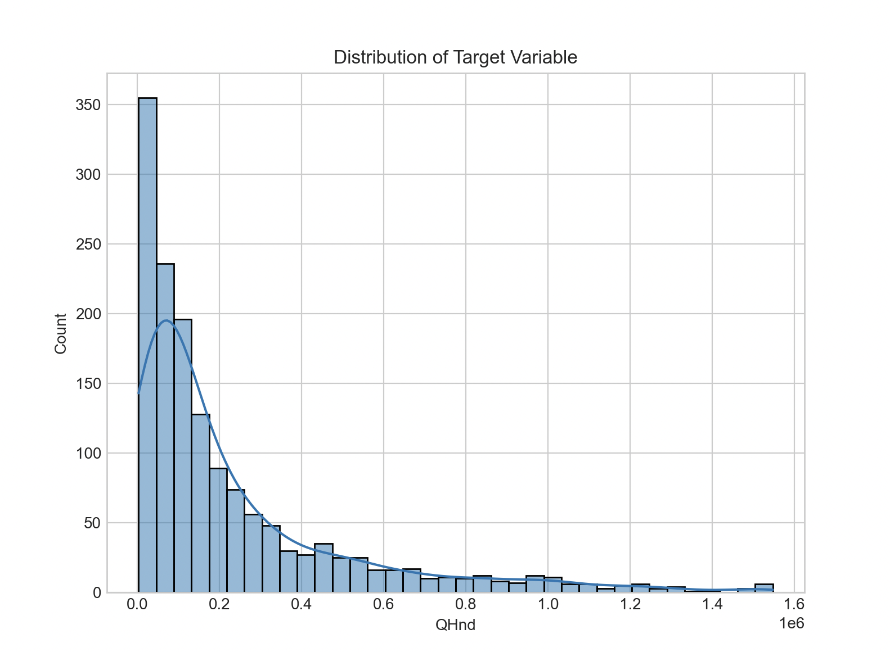
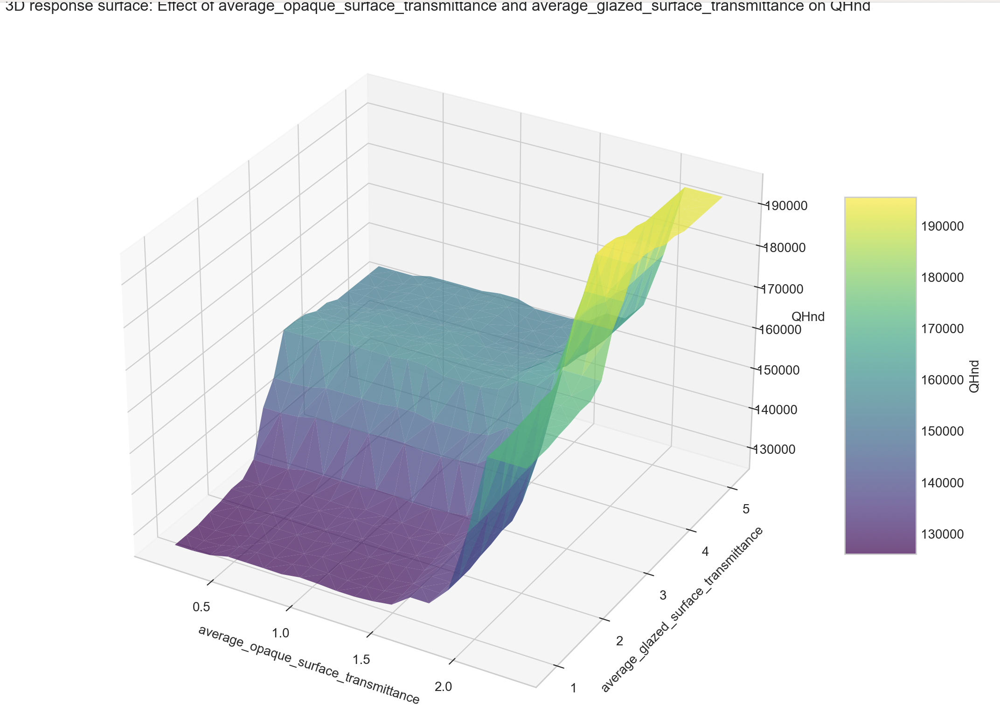
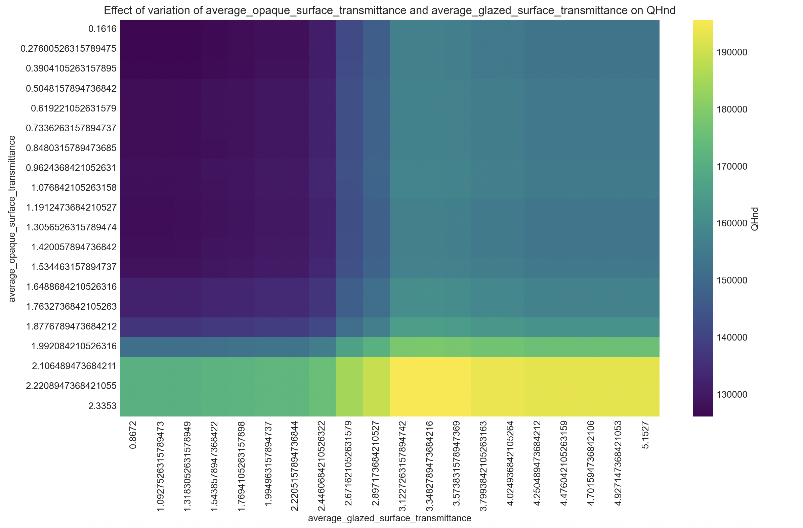
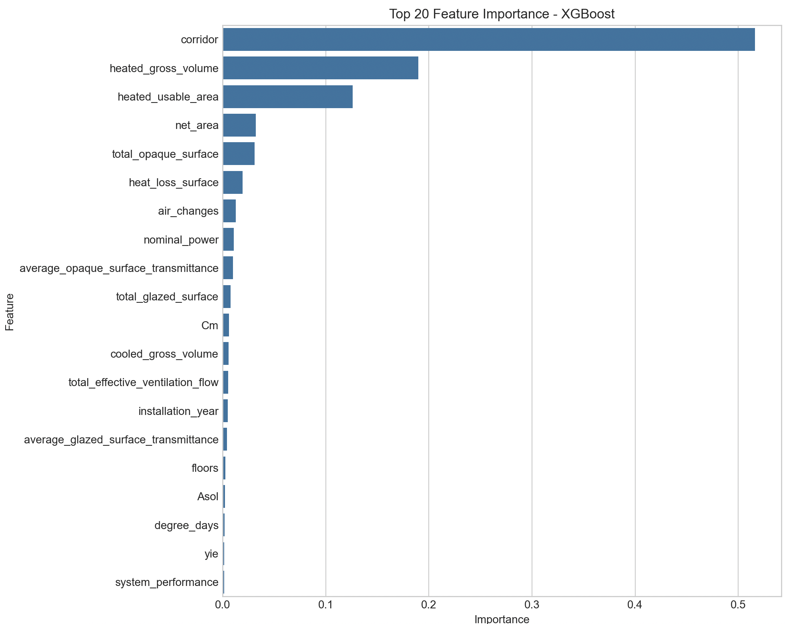
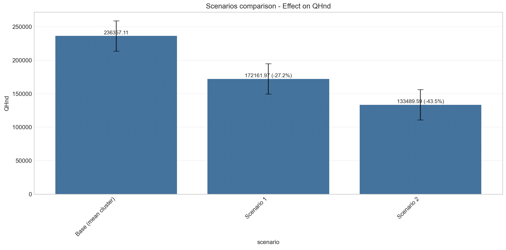

# EPC Clustering adn Sensitivity Analysis

This repository contains a Python script for clustering energy performance data and conducting sensitivity analysis on the clusters.

# How it works

1. The script first loads the dataset and performs an exploratory analysis to understand the data.
2. It then uses a clustering algorithm to group similar data points together.
3. The script then create a regression models of a specific parameter and conducts a sensitivity analysis on the clusters to understand how the clusters change with different parameters.
4. Finally, the script visualizes the results of the sensitivity analysis.

# Installation
```bash
# Set the Python version for the current directory
pyenv local 3.12.6

# Create the Pipenv environment using pyenv
pipenv --python $(pyenv which python)

# Activate the Pipenv environment
pipenv shell

# Install dependencies
pipenv install -r requirements.txt
```

# Usage 
Run the script with the following command:

```bash
python main.py
```

# Methods
## Clustering
Top generate the cluseter the K-means algortihm is used. The number of clusters can be determined using the elbow method or silhouette method.
The resulting clusters are saved in the directory specified by the `clusters_output_dir` parameter.

## Modeling
The script then create a regression models of a specific parameter.
The regression models are creted using the best models created from the following algorithms:
- Random Forest
- XGBoost
- LightGBM

The best models are selected based on the following metrics:
- RMSE: Root mean square error
- R2: Coefficient of determination
- MAE: Mean absolute error

## Sensitivity Analysis
The script then conducts a sensitivity analysis on the clusters to understand how the clusters change with different parameters.
The sensitivity analysis is conducted using the Scenario Analysis method.

The results of the sensitivity analysis are saved in the directory specified by the `results_dir` parameter.

## Optimize Cluster Parameters
The function optimize_cluster_parameters serve for optimizing the sensitive parameters within a cluster of data, with the objective of maximizing or minimizing a predicted target (e.g. the output of a model). It uses Optuna to automatically search for the best combination of values.

## Models
The models are saved in the directory specified by the `models_dir` parameter.

# Parameters
- data_path: Path to the input CSV data file to be loaded as dataframe
- columns_selected: Columns to use for clustering
- cluster_method_custom: Use custom cluster value instead of statistical method (elbow, silhouette, etc.)
- cluster_value: Number of clusters when using custom method
- cluster_method_stat: Statistical method for determining cluster count (elbow, silhouette, etc.)
- columns_to_delete: Columns to delete from the dataset
- save_clusters: Whether to save cluster datasets
- clusters_output_dir: Directory to save cluster datasets (default: data/data_cluster)
- models_dir: Directory to save models (default: models)
- results_dir: Directory to save results (default: results)

# Example








# License
Free software: MIT license

# Contacts
For any question or support, please contact: 
- Daniele Antonucci daniele.antonucci@eurac.edu 
- Olga Somova olga.somova@eurac.edu

## 💙 Acknowledgements
This work was carried out within European projects: 

<p align="center">
  
</p>

Moderate - Horizon Europe research and innovation programme under grant agreement No 101069834, with the aim of contributing to the development of open products useful for defining plausible scenarios for the decarbonization of the built environment